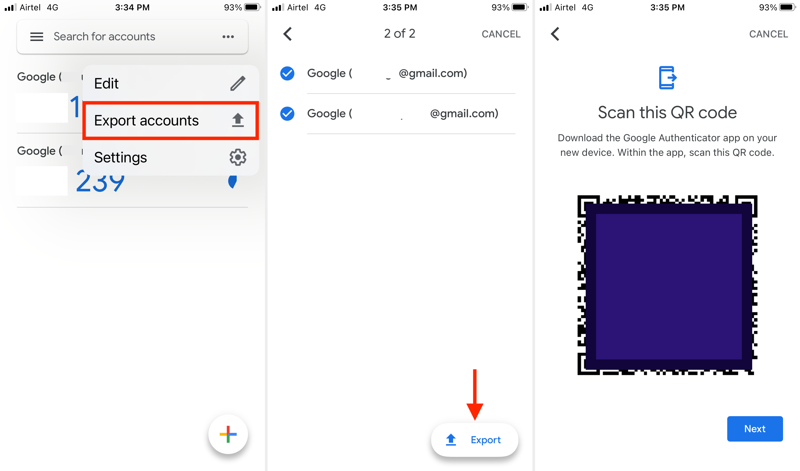
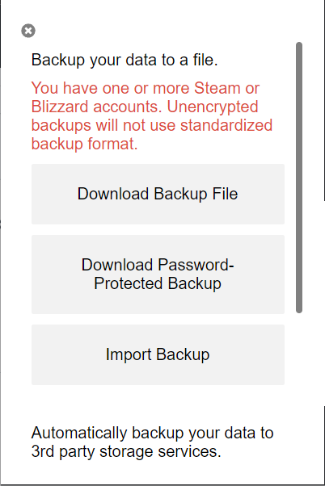

## Setup Login

To use the `aws-keychain` command, you need to register an AWS account. Prepare the following information before running the command:

1. URL of the account (e.g. <https://XXXXXXXXXXX.signin.aws.amazon.com/console>)
2. Username of the account
3. Password of the account
4. QR code image from Google Authenticator or text file from [Chrome Authenticator extension](https://chromewebstore.google.com/detail/authenticator/bhghoamapcdpbohphigoooaddinpkbai). How to obtain this is explained in the last section [Here](#get-qr-code-or-text-file-from-authenticator).

The last item is optional. If you do not have a QR code image or text file, you can skip this step. You can add the MFA token later. or use witout MFA.

### How To

You can do this by running the following command:

```sh
aws-keychain register --qr-path <path> --txt-path <path>
```

There are two optional arguments, `--qr-path` and `--txt-path`,
where `--qr-path` is the path to specify the QR code image from Google Authenticator and `--txt-path` is the path to specify the text file from Chrome Authenticator extension. **If none of the optional arguments are provided, the command still works without MFA.**

After reading the QR code or text file, the interactive prompt will ask you to enter required information to register the account.

```sh
> aws-keychain register --qr-path
Setting up the keychain for the account XXXXXXXXXXXXX (Amazon Web Services)
Enter the URL of the account (e.g. https://accounts.google.com/login): https://XXXXXXXXXXX.signin.aws.amazon.com/console
Enter the username of the account: my-username
Enter the password of the account: my-password
Enter the name for the keychain entry: staging
```

The value `staging` is the name of the keychain entry. It is used to choose the account when logging in.

### Get QR Code or Text File from Authenticator

#### Google Authenticator

Follow the steps below. You can choose mulitple AWS accounts.



#### Chrome Authenticator Extension

1. Click the extension icon on the browser.
2. Click the setting at the left top corner.
3. Click `Backup` button.
4. Click the **first** `Download Backup File` button.


